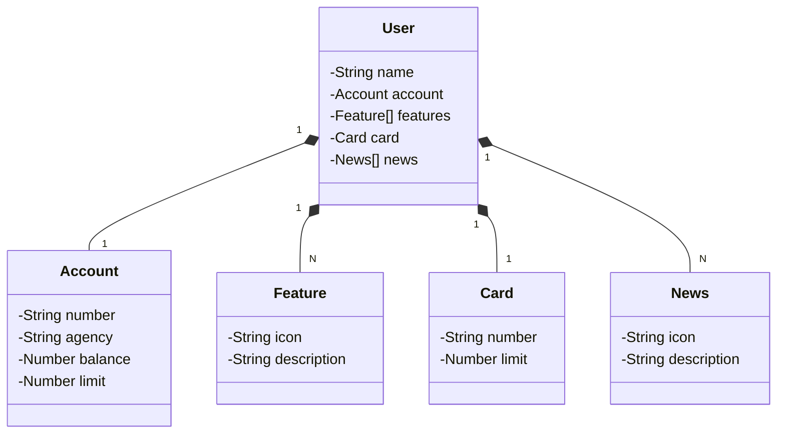

# Projeto Trilha java DIO Backend

#### Deploy de um simples projeto Spring

- 💬 Descrição e objetivo: API REST na Nuvem Usando Spring Boot 3, Java 17 e Railway

  ## Diagrama de Classes (Domínio da API)



# Tabela de conteúdos

<!--ts-->

- [Sobre](#Descrição)
- [Tabela de Conteudo](#tabela-de-conteudo)
- [Pré Requisitos](#pre-requisitos)
- [Configurações](#Configurações)
- [Tecnologias](#tecnologias)
- [Autor](#autor)
  <!--te-->
  <br>

### Pré-Requisitos

Antes de começar, você vai precisar ter instalado em sua máquina as seguintes ferramentas:
[Java JDK](https://www.oracle.com/java/technologies/downloads/) preferência para versão 14 para cima.<br>
Além disto é bom ter um editor para trabalhar com o código como o [IntelliJ](https://www.jetbrains.com/pt-br/idea/).

### 🎲 Configurações

```bash
# Instalar o java JDK na sua máquina preferência para versão 14 para cima
# Configurar o projeto para utilizar o JDK
# Ir no arquivo delegação e colocar o caminho do arquivo para a sua máquina no lugar especificado.
# Executar o arquivo Delegação class main
```

### 🛠 Tecnologias

As seguintes ferramentas foram usadas na construção do projeto:

- [Java](https://www.oracle.com/java/technologies/downloads/)

## Autor

<a href="https://www.linkedin.com/in/gabriel19br/">

<br/>
<sub><b>Gabriel Alves de Lima</b></sub></a>🚀

Feito por Gabriel Alves de Lima 👋🏽 Entre em contato!
